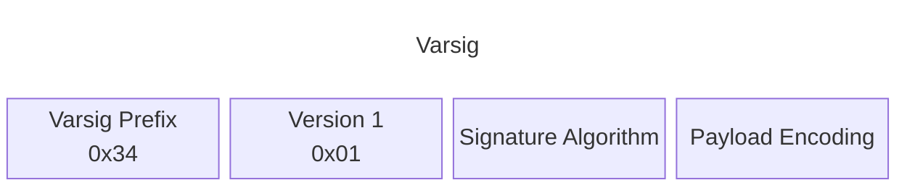
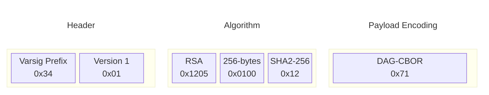
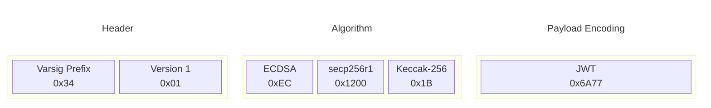

# Varsig Specification v1.0.0

## Editors

* [Brooklyn Zelenka]
* [Irakli Gozalishvili]

## Authors

* [Brooklyn Zelenka]
* [Hugo Dias]
* [Irakli Gozalishvili]
* [Joel Thorstensson]
* [Quinn Wilton]

## Language

The key words "MUST", "MUST NOT", "REQUIRED", "SHALL", "SHALL NOT", "SHOULD", "SHOULD NOT", "RECOMMENDED", "NOT RECOMMENDED", "MAY", and "OPTIONAL" in this document are to be interpreted as described in [BCP 14] when, and only when, they appear in all capitals, as shown here.

## Dependencies

* [Multicodec]

# Abstract

Varsig is a [multiformat][Multiformats] for compactly describing signatures over data and any codec information to serialize the signed data correctly. It is only a description of the signature configuration, but not the signature itself.

# Introduction

Common formats such as [JWT][RFC 7519] use encoding (e.g. [base64]) and text separators (e.g. `"."`) to pass around encoded data and their signatures:

``` js
// JWT
"eyJhbGciOiJFZERTQSIsInR5cCI6IkpXVCIsInVjdiI6IjAuOC4xIn0.eyJhdWQiOiJkaWQ6a2V5Ono
2TWtyNWFlZmluMUR6akc3TUJKM25zRkNzbnZIS0V2VGIyQzRZQUp3Ynh0MWpGUyIsImF0dCI6W3sid2l
0aCI6eyJzY2hlbWUiOiJ3bmZzIiwiaGllclBhcnQiOiIvL2RlbW91c2VyLmZpc3Npb24ubmFtZS9wdWJ
saWMvcGhvdG9zLyJ9LCJjYW4iOnsibmFtZXNwYWNlIjoid25mcyIsInNlZ21lbnRzIjpbIk9WRVJXUkl
URSJdfX1dLCJleHAiOjkyNTY5Mzk1MDUsImlzcyI6ImRpZDprZXk6ejZNa2tXb3E2UzN0cVJXcWtSbnl
NZFhmcnM1NDlFZnU2cUN1NHVqRGZNY2pGUEpSIiwicHJmIjpbXX0.SjKaHG_2Ce0pjuNF5OD-b6joN1S
IJMpjKjjl4JE61_upOrtvKoDQSxZ7WeYVAIATDl8EmcOKj9OqOSw0Vg8VCA"
```

Many binary-as-text encodings are inefficient and inconvenient. Others have opted to use canonicalization and a tag. This can be effective, but requires careful handling and signaling of the specific canonicalization method used (such as [DAG-CBOR]).

``` js
const payload = canonicalize({"hello": "world", "count": 42})
{payload: payload, sig: key.sign(sha256(payload))}
```

Directly signing over canonicalized data introduces new problems: forced encoding and canonicalization attacks.

## Forced Encoding

Data must first be rendered to binary before signing. This means imposing some encoding. There is no standard way to include the encoding that some IPLD was encoded with other than a [CID]. In IPFS, CIDs imply a link, which can have implications for network access and storage. Further, generating a CID means producing a hash, which is then potentially rehashed to conform to the cryptographic signature algorithm. 

To remedy this, Varsig includes the encoding information used in production of the signature.

## Canonicalization Attacks

Since formats like [IPLD] and [JCS] are deterministically encoded, it can be tempting to rely on canonicalization at validation time, rather than storing the serialized bytes. Since the original payload can be rederived from the output, this can seem like a clean option:

``` javascript
// DAG-JSON
{
  "role": "user",
  "links": [
    {"/": "bafkreidb2q3ktgtlm5yio7buj3sypyghjtfh5ernsteqmakf4p2c5bwmyi"},
    {"/": "bafkreic75ydg5vkw324oqkcmqltfvc3kivyngqkibjoysdwiilakh4z5fe"},
    {"/": "bafkreiffdiz6raf46zrr3b2usufgz5fo44aggmocz4zappr6khhhljcdpy"}
  ],
  "sig": "8ufaS9w3CGN8cbQTUSoL1i7eaKiWLSXsD2LbZVmvM9zF"
}
```

Unfortunately this opens the potential for [canonicalization attacks]. [Parsers for certain formats][Taxonomy of Attacks] — such as JSON — are known to [handle duplicate entries differently][How (not) to sign a JSON object]. IPLD MUST be serialized to a canonical form before checking the signature. Without careful handling, it is possible to fail to check if any additional fields have been added to the payload which will be parsed by the application. 

> An object whose names are all unique is interoperable in the sense that all software implementations receiving that object will agree on the name-value mappings.  When the names within an object are not unique, the behavior of software that receives such an object is unpredictable.  Many implementations report the last name/value pair only.  Other implementations report an error or fail to parse the object, and some implementations report all of the name/value pairs, including duplicates.
>
> — [RFC 8259]

``` json
{
  "role": "user",  // Parsed by an IPLD implementation
  "role": "admin", // Malicious duplicate field, omitted by the IPLD parser, accepted by the browser
  "links": [
    {"/": "bafkreidb2q3ktgtlm5yio7buj3sypyghjtfh5ernsteqmakf4p2c5bwmyi"},
    {"/": "bafkreic75ydg5vkw324oqkcmqltfvc3kivyngqkibjoysdwiilakh4z5fe"},
    {"/": "bafkreiffdiz6raf46zrr3b2usufgz5fo44aggmocz4zappr6khhhljcdpy"}
  ],
  "sig": "8ufaS9w3CGN8cbQTUSoL1i7eaKiWLSXsD2LbZVmvM9zF"
}
```

In the above example, the canonicalization step MAY lead to the signature passing validation, but the client parsing the `role: "admin"` field instead.

### Example

The above can be [subtle][PKI Layer Cake]. Here is a step by step example of one such scenario.

An application receives some block of data, as binary. It checks the claimed CID, which passes validation.

```
0x7ba202022726f6c65223a202275736572222ca202022726f6c65223a202261646d696e222ca202
0226c696e6b73223a205ba202020207b222f223a20226261666b72656964623271336b7467746c6d
3579696f3762756a337379707967686a7466683565726e737465716d616b66347032633562776d79
69227d2c202020202020202020202020202020202020202020202020202020202020202020202020
20202020202020202020202020202020202020202020202020202020202020202020202020202020
20202020202020202020202020202020202020202020202020202020202020202020202020202020
2020202020202020202020207b222f223a20226261666b72656963373579646735766b773332346f
716b636d716c74667663336b6976796e67716b69626a6f7973647769696c616b68347a356665227d
2ca202020207b222f223a20226261666b726569666664697a3672616634367a72723362327573756
6677a35666f34346167676d6f637a347a61707072366b6868686c6a63647079227da20205d2ca202
022736967223a2022387566615339773343474e386362515455536f4c31693765614b69574c53587
344324c625a566d764d397a4622a7d
```

Decoded to a string, the above reads as follows:

```
{\n
  {\n
    "role": "user",\n
    "role": "admin",\n
    "links": [\n
      {"/": "bafkreidb2q3ktgtlm5yio7buj3sypyghjtfh5ernsteqmakf4p2c5bwmyi"},\n
      {"/": "bafkreic75ydg5vkw324oqkcmqltfvc3kivyngqkibjoysdwiilakh4z5fe"},\n
      {"/": "bafkreiffdiz6raf46zrr3b2usufgz5fo44aggmocz4zappr6khhhljcdpy"}\n
    ],\n
  },\n
  "sig": "8ufaS9w3CGN8cbQTUSoL1i7eaKiWLSXsD2LbZVmvM9zF"\n
}
```

> [!NOTE]
> The JSON above contains a duplicate `role` key.

Next, the application parses the JSON with the browser's native JSON parser. Only one `role` key is possible in a JavaScript object, and which one is kept is not consistency across implementations.

``` json
{
  {
    "role": "admin", // Picked the second key
    "links": [
      {"/": "bafkreidb2q3ktgtlm5yio7buj3sypyghjtfh5ernsteqmakf4p2c5bwmyi"},
      {"/": "bafkreic75ydg5vkw324oqkcmqltfvc3kivyngqkibjoysdwiilakh4z5fe"},
      {"/": "bafkreiffdiz6raf46zrr3b2usufgz5fo44aggmocz4zappr6khhhljcdpy"}
    ]
  },
  "sig": "8ufaS9w3CGN8cbQTUSoL1i7eaKiWLSXsD2LbZVmvM9zF"
}
```

The application MUST check the signature of all fields minus the `sig` field. Under the assumption that the binary input was safe, and that canonicalization allows for the deterministic manipulation of the payload, the object is parsed to an internal representation.

``` rust
{
  role: "user",
  links: [
    Cid("bafkreiffdiz6raf46zrr3b2usufgz5fo44aggmocz4zappr6khhhljcdpy"),
    Cid("bafkreic75ydg5vkw324oqkcmqltfvc3kivyngqkibjoysdwiilakh4z5fe"),
    Cid("bafkreiffdiz6raf46zrr3b2usufgz5fo44aggmocz4zappr6khhhljcdpy"),
  ],
  sig: 0xf2e7da4bdc3708637c71b413512a0bd62ede68a8962d25ec0f62db6559af33dc
}
```

> [!NOTE]
> In our scenario, the parser has dropped the `role: "admin"` key. This is nondeterministic based on the specific implementation.

The `sig` field is then removed, and the remaining fields serialized to binary;

``` rust
serialize!({
  role: "user",
  links: [
    Cid("bafkreidb2q3ktgtlm5yio7buj3sypyghjtfh5ernsteqmakf4p2c5bwmyi"),
    Cid("bafkreic75ydg5vkw324oqkcmqltfvc3kivyngqkibjoysdwiilakh4z5fe"),
    Cid("bafkreiffdiz6raf46zrr3b2usufgz5fo44aggmocz4zappr6khhhljcdpy"),
  ]
}).to_json()
```

The signature is then checked against the above fields, which passes since there's only a `role: "user"` entry. The application then uses the original JSON with the `role: "admin"` entry.

# Safety

Data already parsed to an in-memory representation can be canonically encoded trivially: it has already been through a [parser / validator][Parse Don't Validate].

Data purporting to conform to an IPLD encoding (such as [DAG-JSON]) MUST be validated prior to signature verification. This MAY be as simple as round-trip decoding/encoding the JSON and checking that the hash matches. A validation error MUST be signaled if it does not match.

> Implementers may provide an opt-in for systems where round-trip determinism is a desireable [sic] feature and backward compatibility with old, non-strict data is unnecessary.
>
> — [DAG-JSON Spec][DAG-JSON]

As it is critical for guarding against various attacks, the assumptions around canonical encoding MUST be enforced.

# Format

A Varsig MUST metadata about both the [signature] and [payload encoding] that was signed over. Either field MAY be composed of one or more segments. The number of segments MUST be determined by the first segment. Recursive sub-segments MAY be used.

Varsig itself MUST contain the following sgments:

* [Prefix]: The Varsig [multicodec] prefix `0x34`
* [Version]: The Varsig version number `0x01`
* [Signature Algorithm]: A signature algorithm tag and any additional fields needed to configure it
* [Payload Encoding]: The codec used to render the payload to binary

A Varsig MUST begin with one or more segments that configure the signature.



<details>

<summary>ABNF</summary>

```abnf
varsig-header = %x34 signature-algorithm-metadata payload-encoding-metadata
signature-algorithm-metadata = unsigned-varint
payload-encoding-metadata = unsigned-varint
```

</details>

For example, an [RS256] signature over some [DAG-CBOR] is as follows:
 


A (canonicalized) [JWT] signed with [ES256K] is as follows:



## Prefix

The Varsig prefix MUST be the [multicodec] value `0x34`.

## Version

A Varsig v1 MUST use the `0x01` version tag.

## Signature Algorithm

The signature algorithm field MUST consist of one or more unsigned varint ([LEB128]) segments. The first segment MUST act as a discriminant for the signature algorithm plus the number and type of the fields used to configure that signature type.

| Prefix   | [LEB128] Varint | Segments                                 | Description                        |
|----------|-----------------|------------------------------------------|------------------------------------|
| `0xB1`   | `0xB101`        | `bls-public-key-curve` `multihash`       | BLS12_381 (public key on G1 or G2) |
| `0xEC`   | `0xEC01`        | `ecdsa-curve` `recovery-bit` `multihash` | ECDSA (e.g. ES256)                 |
| `0xED`   | `0xED01`        | `eddsa-curve` `multihash`                | EdDSA (e.g. Ed25519, Ed448)        |
| `0x1205` | `0x8524`        | `rsa-byte-length` `multihash`            | RSASSA-PKCS #1 v1.5                |

<details>

<summary>ABNF</summary>

``` abnf
varsig-signature-algorithm
  = %xB1   bls-public-key-curve        multihash-header ; BLS
  / %xEC   ecdsa-curve recovery-parity multihash-header ; ECDSA
  / %xED   eddsa-curve                 multihash-header ; EdDSA
  / %x1205 rsa-size                    multihash-header ; RSASSA-PKCS #1 v1.5
```

</details>

## Payload Encoding

Canonical encodings are convenient for many applications since they allow for efficient storage, compact internal representations, or the conversion between formats like JSON and CBOR. Unfortunately signatures require signing over specific bytes, and thus over a specific encoding of the data. To facilitate this, the type `varsig-encoding-metadata` MUST be used:

| Code     | [LEB128] Varint | Description                                     |
|----------|-----------------|-------------------------------------------------|
| `0x5F`   | `0x5F`          | Byte-identical payload (no additional encoding) |
| `0x71`   | `0x71`          | [DAG-CBOR]                                      |
| `0x0129` | `0xa902`        | [DAG-JSON]                                      |
| `0xE191` | `0x91c303`      | [EIP-191 "personal sign"][EIP-191-ps]           |

<details>

<summary>ABNF</summary>

``` abnf
varsig-encoding-metadata
  = %x5F                        ; Byte-identical payload (no additional encoding)
  / %x71                        ; DAG-CBOR multicodec prefix
  / %x0129                      ; DAG-JSON multicodec prefix
  / %xE191 varsig-encoding-info ; EIP-191 "personal sign"
```

</details>

# Signing Over Varsig

Including the Varsig in the payload that is signed over is RECOMMENDED. Doing so eliminates any ambiguity of the signed payload format and signature algorithm configuration.

# Acknowledgments

Thanks to [Michael Muré] for feedback from real-world implementation.

Our gratitude to [Dave Huseby] for his parallel work and critiques of our earlier design.

<!-- Internal Links -->

[Header]: #header
[Payload Encoding]: #payload-encoding
[Prefix]: #varsig-multicodec-prefix
[Signature Algorithm]: #signature-algorithm
[Signature]: #signature
[Version]: #version

<!-- External Links -->

[BCP 14]: https://www.rfc-editor.org/info/bcp14
[Brooklyn Zelenka]: https://github.com/expede/
[CAR]: https://ipld.io/specs/transport/car/
[CID]: https://docs.ipfs.tech/concepts/content-addressing/
[DAG-CBOR]: https://ipld.io/docs/codecs/known/dag-cbor/
[DAG-JSON]: https://ipld.io/specs/codecs/dag-json/spec/
[DKIM]: https://en.wikipedia.org/wiki/DomainKeys_Identified_Mail
[Dave Huseby]: https://github.com/dhuseby
[EIP-191-ps]: https://eips.ethereum.org/EIPS/eip-191#version-0x45-e
[EIP-191]: https://eips.ethereum.org/EIPS/eip-191
[ES256K]: https://w3c-ccg.github.io/lds-ecdsa-secp256k1-2019/
[EdDSA]: https://datatracker.ietf.org/doc/html/rfc8032
[How (not) to sign a JSON object]: https://latacora.micro.blog/2019/07/24/how-not-to.html
[Hugo Dias]: https://github.com/hugomrdias
[IPLD Data Model]: https://ipld.io/docs/data-model/kinds/
[IPLD]: https://ipld.io/docs/
[Irakli Gozalishvili]: https://github.com/Gozala
[JCS]: https://www.rfc-editor.org/rfc/rfc8785
[JWT]: https://www.rfc-editor.org/rfc/rfc7519
[Joel Thorstensson]: https://github.com/oed
[LEB128]: https://en.wikipedia.org/wiki/LEB128
[Michael Muré]: https://github.com/MichaelMure
[Multicodec]: https://github.com/multiformats/multicodec
[Multiformats]: https://multiformats.io
[PKI Layer Cake]: https://link.springer.com/chapter/10.1007/978-3-642-14577-3_22
[Parse Don't Validate]: https://lexi-lambda.github.io/blog/2019/11/05/parse-don-t-validate/
[Quinn Wilton]: https://github.com/QuinnWilton/
[RFC 2119]: https://datatracker.ietf.org/doc/html/rfc2119
[RFC 7519]: https://www.rfc-editor.org/rfc/rfc7519
[RFC 8259]: https://www.rfc-editor.org/rfc/rfc8259#page-10
[RS256]: https://datatracker.ietf.org/doc/html/rfc7518
[RSASSA-PKCS #1 v1.5]: https://www.rfc-editor.org/rfc/rfc2313
[Taxonomy of Attacks]: https://www.blackhat.com/presentations/bh-usa-07/Hill/Whitepaper/bh-usa-07-hill-WP.pdf
[`secp256k1`]: https://en.bitcoin.it/wiki/Secp256k1
[base64]: https://en.wikipedia.org/wiki/Base64
[canonicalization attacks]: https://soatok.blog/2021/07/30/canonicalization-attacks-against-macs-and-signatures/
[multibase]: https://github.com/multiformats/multibase
[multicodec]: https://github.com/multiformats/multicodec
[raw binary multicodec]: https://github.com/multiformats/multicodec/blob/master/table.csv#L40
[unsigned varint]: https://github.com/multiformats/unsigned-varint
