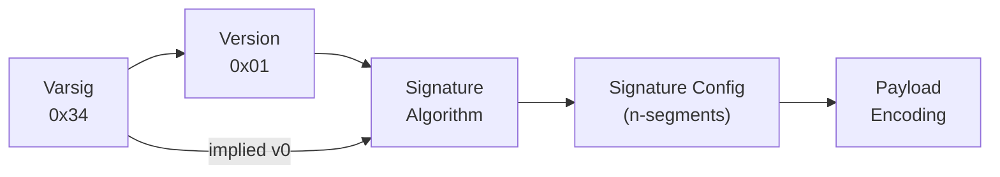

# Upgrade Guide

Compatibility with pre-1.0 Varsig is OPTIONAL but possible by detecting when version field is absent. There are no low-numbered signature algorithm tags such as `0x01` or `0x02`, so when failing a parse, an implementation MAY fall back to a v0.x parser.

